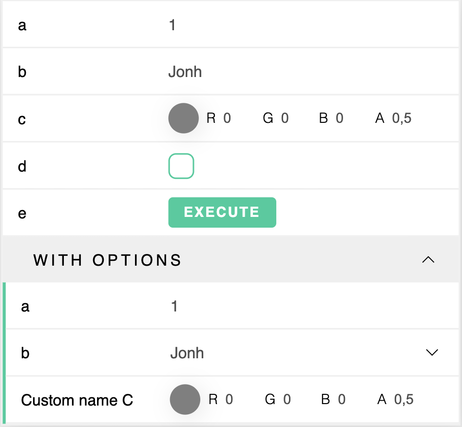
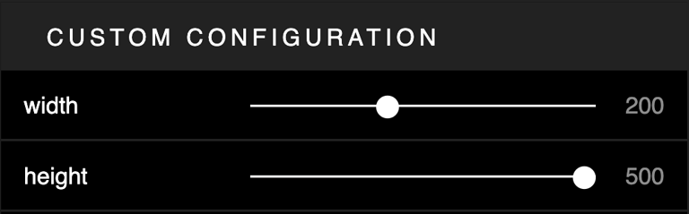

# data-gui

[](https://github.com/SolalDR/data-gui/actions/workflows/build.yml)
[](https://github.com/GIScience/badges#experimental)
[](https://npmjs.org/package/data-gui)</sup>


*The aim of `data-gui` is to create a scalable and lightweight user interface to tweak variables in JS.
This tool is a modern alternative to Dat.GUI using webcomponents.*

[Documentation](https://solaldr.github.io/data-gui/index.html) — [Demo](https://data-gui.netlify.app)<br>

## Features
- [x] Control several types of data (`number`, `string`, `blob`, `boolean`, `function`, `color`)
- [x] Automatically listen to outside changes and perform GUI updates
- [x] Customize styles with CSS variables
- Create custom controller
- Save or share your preset

## Installation

```
npm i data-gui --save
```

```
yarn add data-gui
```

## How to use

### Basic use



```javascript
// See result below 
import GUI from 'data-gui'

const target = {
  a: 1,
  b: "Jonh",
  c: "rgba(0, 0, 0, 0.5)",
  d: false,
  e: () => alert("Hello E")
}

const gui = new GUI()
gui.add('a', target)
gui.add('b', target)
gui.add('c', target)
gui.add('d', target)
gui.add('e', target)

const g = gui.group({ name: 'With options' })
g.add('a', target, { min: 0, max: 100, step: 0.1 })
g.add('b', target, { choices: ["Jonh", "Foo", "Bar"] })
g.add('c', target, { name: "Custom name C"})
```


Consult [controller documentation](https://solaldr.github.io/data-gui/classes/basecontroller.html) for more information

### GUI Configuration



```javascript
const gui = new GUI({
  name: "Custom name"
  theme: "dark"
}) 
gui.add('width', target, { min: 0, max: 500 })
gui.add('height', target, { min: 0, max: 500 })
```

</p>

Consult [GUI page](https://solaldr.github.io/data-gui/classes/gui.html) in the documentation for more information


## License

[MIT](LICENSE).
